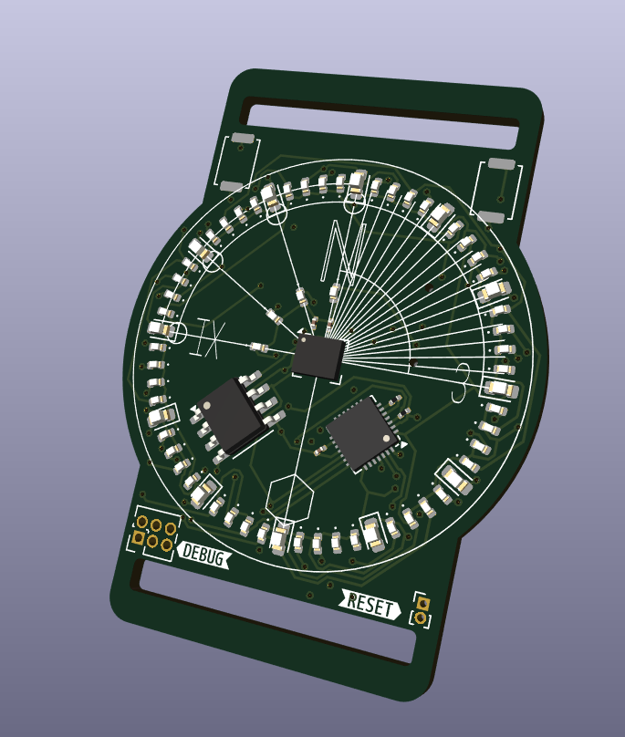

# Hourglass
Hourglass is a custom PCB watch designed in KiCAD 7.0, to be funded by the Hack Club [OnBoard](https://github.com/hackclub/OnBoard/) grant, which allocates $100 for high schoolers to design and build their own custom PCBs.

## Revisions
### [Revision A:](./hourglass_reva/) Original design
> `Status: ✔️ (COMPLETE)`

Revision A is the original design, based on the Atmel ATMega32u4 microcontroller. It features a RTC and 9DoF magnetometer-accelerometer to detect orientation, magnetic field strength and more to act as both a device for keeping time and sense when the wearer has raised the watchface to observe. In addition, a USB-C port can allow for interfacing directly to the Mega for uploading code and other functions.

### [Revision B:](./hourglass_reva/) Cost-effective design
> `Status: 🚧 (IN PROGRESS)`

Revision B is a easier, more affordable option. I'm working on this primarily because revision A is simply too expensive with all peripherals added in to have assembled via JLC's PCBA. It swaps the ATMega32 with an ATTiny84, the 9DoF magnetometer with a cheaper, magnetometer-only IC, and forgoes the need for dual-sided PCBA by having all SMD parts on one side.
